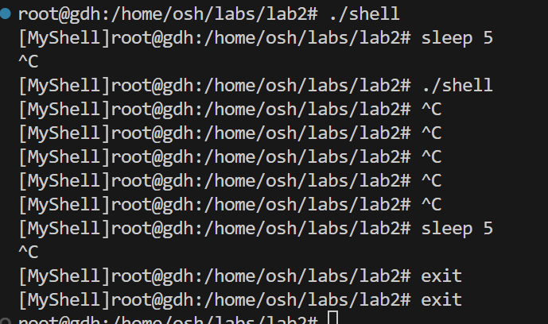

# Lab2 简易shell

PB22020514 郭东昊

## 实现内容
我并没有全部实现所有必做功能

### 目录导航
- 正确实现 pwd 内建命令	10%
- 正确实现 cd 内建命令	10%
- 「可选」 cd 在没有第二个参数时，默认进入家目录	5%

### 管道
- 支持两条命令的管道	10%
- 支持任意多条命令的管道	10%

### 重定向
- 支持 > 重定向	5%
- 支持 < 重定向	5%
- 支持 >> 重定向	5%
- 「可选」 支持数字文件描述符	5%
- 「可选」 支持文本重定向	5%
- 「可选」 支持 EOF 重定向	5%

### 信号处理
- CTRL+C 正确终止正在运行的进程	5%
- CTRL+C 在 shell 嵌套时也能正确终止正在运行的进程	10%
- CTRL+C 可以丢弃命令	10%

### 前后台进程
- 后台程序运行	10%
- 实现 wait 命令	10%

## 可能与shell不同的地方
- 重定向只支持一条命令 即重定向符号两边各一个命令/文件
- Linux中，EOF重定向本质上采用任何自定义的字符串作为结束符都可以，但是本程序只实现了`EOF`的重定向
- 管道命令不依赖管道符两边的空格
- 重定向命令依赖重定向符号两边的空格
- 为体现与shell的不同，输入提示符前加入了`[Myshell]`
- 助教要求提示符为`$`即可，我的shell输出了prompt如下图（这是嵌套执行shell正确的代码），而且可以把家目录压缩为~
- 
- 程序在后台运行时，如`ls &`命令，原生Linux Bash会输出，但是MyShell不输出，做了输入输出的重定向

## 实现思路
封装了多个函数，使main函数可读性提高，框架清晰。

shell通过一个while循环来循环读入命令和执行。执行命令时，若遇到单条内建命令，直接执行，否则，均fork()产生一个子进程（下称子进程0）。

在子进程0中，处理管道命令、重定向命令和一般命令。

## 不足之处
- 没有足够多的测试，缺少很多错误处理