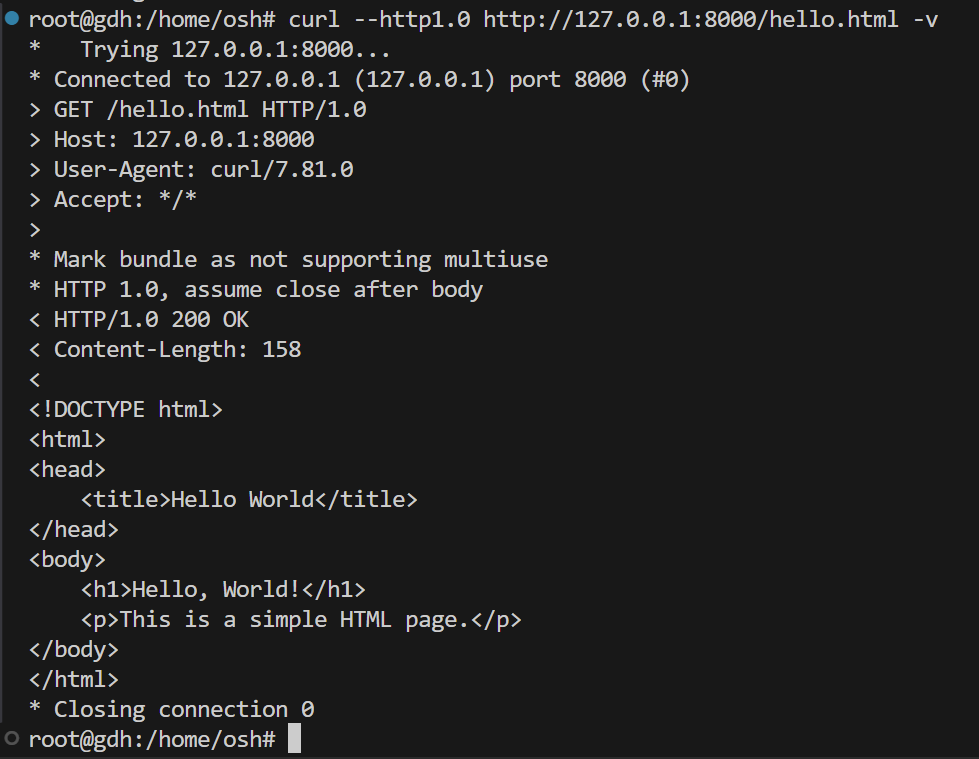
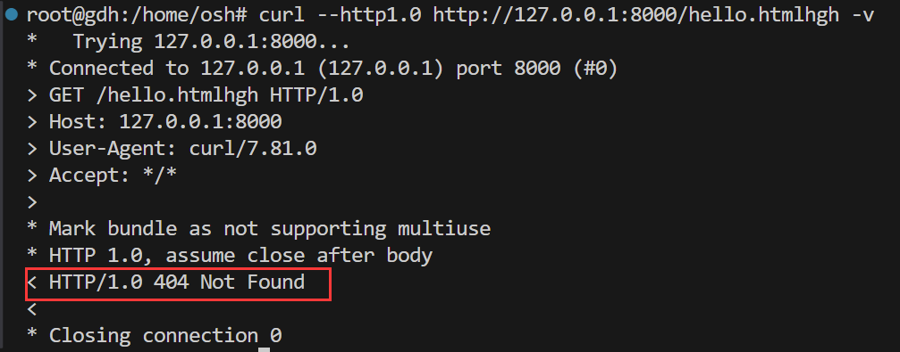
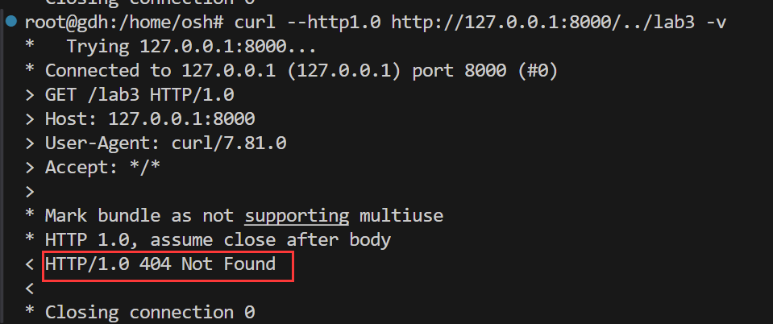
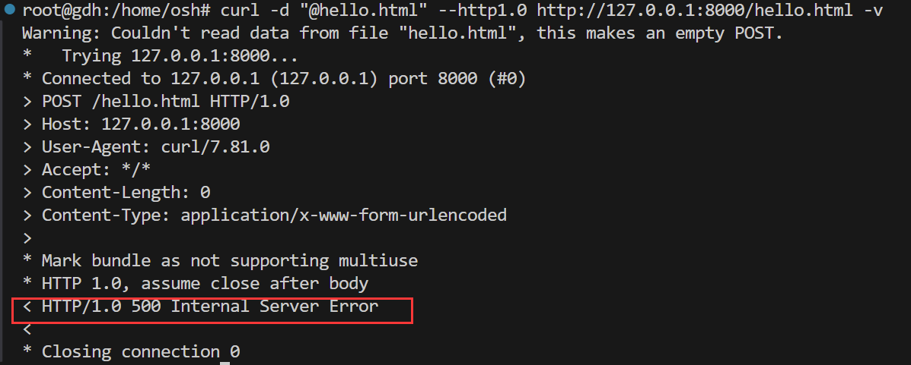
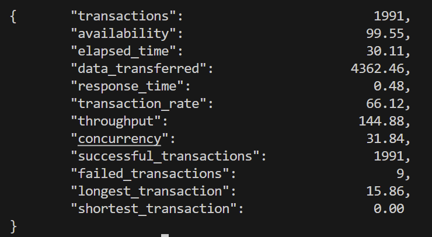
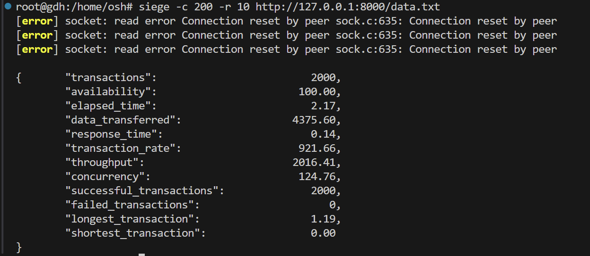

# Lab3 Report

PB22020514 郭东昊

## 实现的选做

线程池

## 编译和运行方法

在根目录提供了`makefile`，并且默认源是`src`文件夹，默认目标是建立`build`文件夹，在根目录终端输入`make`时，会在根目录下建立`build`文件夹，并将生成的可执行文件`server`放进`build`中，只需要输入:
```
> ./build/server
```
即可运行线程池版本的服务器。 若需要删除，直接输入`make clean`指令即可删除`build`文件夹

当然，为了比较性能优化的幅度，在根目录下也保留了一个`server.c`文件，这是一个没有使用任何优化的服务器，只需要在终端输入：
```
> gcc server.c -o server
```
即可在根目录下生成一个可执行文件`server`，输入：
```
> ./server
```
即可运行这个服务器。

## 实验原理

首先创建服务器端套接字server_socket，将套接字与指定的IP、端口绑定，接下来使其进入监听状态，等待客户端发起请求。

接下来创建客户端套接字client_socket，进行循环，由于accept函数具有阻塞性，当客户端没有连接时，会阻塞在accept中，直到有信号进入时，会直接调用handle函数，对客户端的请求加以处理。

在处理客户端请求时，需要先读取请求，在读取请求时，需要注意不能认为其一次可以读取完毕，需要循环读取，并且将读取的结果连接起来，并且判断请求头是否是GET，直到读到\r\n\r\n时停止。根据读的结果截取文件，判断文件类型并返回对应的文件描述符或者错误信号。根据文件描述符向客户端写入信号，若是200信号，可以循环读取文件内容并向客户端写回内容。

## 实验结果

- 请求资源路径是一个正常文件



- 请求资源路径不存在



- 请求资源跳出当前目录



- method不是GET



## 性能比较

- 采用`siege -c 200 -r 10 http://127.0.0.1:8000/data.txt`进行测试，data.txt文件是约为2MB的文件。1MB以下的文件已通过完全没问题在这就不展示了。

- 普通的server



- 线程池server



结果显示了两种服务器配置在处理大量并发请求时的性能差异。这些结果可以归结为以下几个关键指标：

1. **Transactions**: 线程池服务器成功处理了更多的事务（2000）而且没有失败的事务，这表示它更加可靠。

2. **Availability**: 线程池服务器的可用性达到了100%，表明它能够处理所有请求，而普通服务器只有99.55%的可用性，表明有少量请求未能成功处理。

3. **Elapsed Time**: 线程池服务器处理相同数量的请求所需时间大大减少，只有2.17秒，而普通服务器需要30.11秒。

4. **Data Transferred**: 两种服务器传输的数据量相似，这表明在处理类似工作负载时两者都能处理大量数据。

5. **Response Time**: 线程池服务器的平均响应时间（0.14秒）远远低于普通服务器（0.48秒），说明线程池服务器更快地响应了用户的请求。

6. **Transaction Rate**: 线程池服务器的事务处理速率显著提高，达到了921.66个事务/秒，相比之下，普通服务器只有66.12个事务/秒。

7. **Throughput**: 线程池服务器的吞吐量（2016.41）显著高于普通服务器（144.88），表示它能以更高的速度传输数据。

8. **Concurrency**: 线程池服务器在高并发（124.76）情况下依旧能够维持服务，而普通服务器的并发处理能力较低（31.84）。

9. **Longest and Shortest Transaction**: 线程池服务器处理请求的时间更均匀，最长事务时间只有1.19秒，而普通服务器最长事务时间为15.86秒。

从这些数据可以看出，使用线程池的server在多个方面都显著优于普通的server。线程池通过重用一定数量的线程，能够减少线程创建和销毁的开销，提高了资源的利用效率和响应速度。这种架构特别适合处理大量短暂且频繁的网络请求，对于提高Web服务器的性能是非常有利的。

## 总结

这次实验我的收获很大，不仅学习了如何通过线程池来优化服务器性能，还亲自体验了性能优化带来的实际效果。通过对比测试，我能够直观地看到线程池对于服务器处理高并发情况下的重要性。而且，通过实际操作，我更深入地理解了网络编程以及多线程编程的原理和实践。